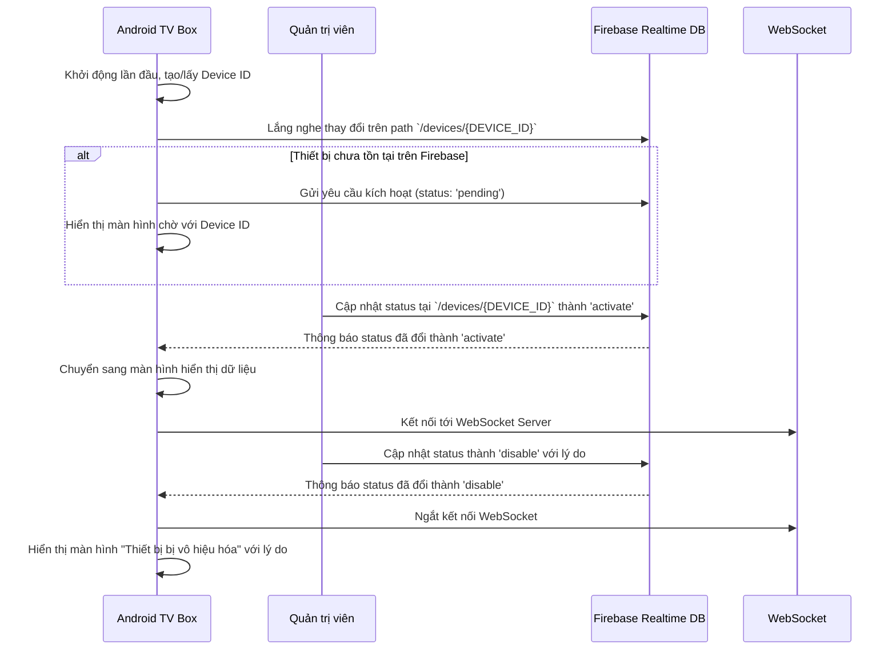

# Quy Trình Quản Lý Trạng Thái Thiết Bị Android TV Box

Tài liệu này mô tả luồng hoạt động của quá trình quản lý trạng thái thiết bị TV Box (chờ, kích hoạt, và vô hiệu hóa), dành cho Lập trình viên để hiểu rõ logic hệ thống và Quản trị viên để quản lý thiết bị.

## Tổng quan

Quy trình quản lý trạng thái đảm bảo rằng chỉ những thiết bị đã được cấp phép (`activate`) mới có thể kết nối và hiển thị dữ liệu. Hệ thống cũng cho phép vô hiệu hóa (`disable`) thiết bị từ xa. Quá trình này sử dụng một cấu trúc dữ liệu duy nhất trên Firebase Realtime Database để quản lý trạng thái của các thiết bị.

## Sơ đồ Luồng Hoạt Động



## Các Bước Chi Tiết

### 1. Phía Ứng Dụng (Android TV Box)

Khi ứng dụng khởi động, nó sẽ thực hiện các bước sau:

1.  **Kiểm tra và Lấy Device ID**: Tương tự quy trình cũ, ứng dụng sẽ tạo mới hoặc lấy `Device ID` đã được lưu cục bộ.
2.  **Lắng nghe Trạng thái**: Ứng dụng bắt đầu lắng nghe (listen) các thay đổi trên đường dẫn `/devices/{DEVICE_ID}` trên Firebase Realtime Database.
3.  **Xử lý theo Trạng thái**:
    *   **Nếu `status` là `pending` (hoặc chưa có dữ liệu):** Ứng dụng sẽ hiển thị màn hình chờ kích hoạt với `Device ID`. Người dùng có thể nhấn nút "Yêu cầu Kích hoạt" để tạo một bản ghi mới trên Firebase với `status: "pending"`.
    *   **Nếu `status` là `activate`:** Ứng dụng sẽ chuyển sang màn hình chính, kết nối tới WebSocket server và bắt đầu hiển thị dữ liệu.
    *   **Nếu `status` là `disable`:** Ứng dụng sẽ ngay lập tức ngắt kết nối WebSocket (nếu có) và hiển thị màn hình thông báo "Thiết bị đã bị vô hiệu hóa", kèm theo lý do được lấy từ trường `description`.
4.  **Tự động cập nhật**: Ứng dụng sẽ luôn lắng nghe. Nếu trạng thái thiết bị thay đổi (ví dụ từ `activate` sang `disable`), ứng dụng sẽ tự động chuyển màn hình và thực hiện hành động tương ứng mà không cần khởi động lại.

### 2. Phía Quản Trị Viên (Hệ Thống)

Để quản lý trạng thái một thiết bị, Quản trị viên cần:

1.  **Lấy Device ID**: Lấy `Device ID` đang được hiển thị trên màn hình chờ của TV Box.
2.  **Quản lý trên Firebase**:
    *   Truy cập vào Firebase Realtime Database của dự án.
    *   Điều hướng đến node `devices`.
    *   Tìm child node có tên là `Device ID` của thiết bị cần quản lý.
    *   **Để kích hoạt**: Cập nhật giá trị của trường `status` thành `"activate"`.
    *   **Để vô hiệu hóa**: Cập nhật giá trị của trường `status` thành `"disable"` và thêm lý do vào trường `description`.

## Cấu Trúc Dữ Liệu trên Firebase

Chúng ta sử dụng một node duy nhất là `devices` để quản lý tất cả các thiết bị.

**Cấu trúc:**
```json
{
  "devices": {
    "DEVICE_ID_1": {
      "status": "activate",
      "name": "DEVICE_ID_1",
      "description": "Khách hàng VIP",
      "createDay": 1678886400000,
      "updateDate": 1678886500000,
      "approvedBy": "admin_username"
    },
    "DEVICE_ID_2": {
      "status": "pending",
      "name": "DEVICE_ID_2",
      "description": null,
      "createDay": 1678887400000,
      "updateDate": 1678887400000,
      "approvedBy": null
    },
    "DEVICE_ID_3": {
      "status": "disable",
      "name": "DEVICE_ID_3",
      "description": "Hết hạn thanh toán.",
      "createDay": 1678888400000,
      "updateDate": 1678889500000,
      "approvedBy": "admin_username"
    }
  }
}
```
- `DEVICE_ID_*`: Là mã UUID duy nhất của mỗi thiết bị.
- `name`: Tên của thiết bị, mặc định là `DEVICE_ID`. Tên này không thể thay đổi.
- `status`: Trạng thái hiện tại của thiết bị. Có 3 giá trị:
    - `"pending"`: Thiết bị đang chờ được kích hoạt.
    - `"activate"`: Thiết bị đã được kích hoạt và được phép hoạt động.
    - `"disable"`: Thiết bị đã bị vô hiệu hóa từ xa.
- `description`: Chứa mô tả hoặc lý do, đặc biệt quan trọng khi `status` là `disable`.
- `createDay`, `updateDate`: Timestamp quản lý thời gian tạo và cập nhật gần nhất.
- `approvedBy`: Tên quản trị viên đã thực hiện thay đổi (tùy chọn).
