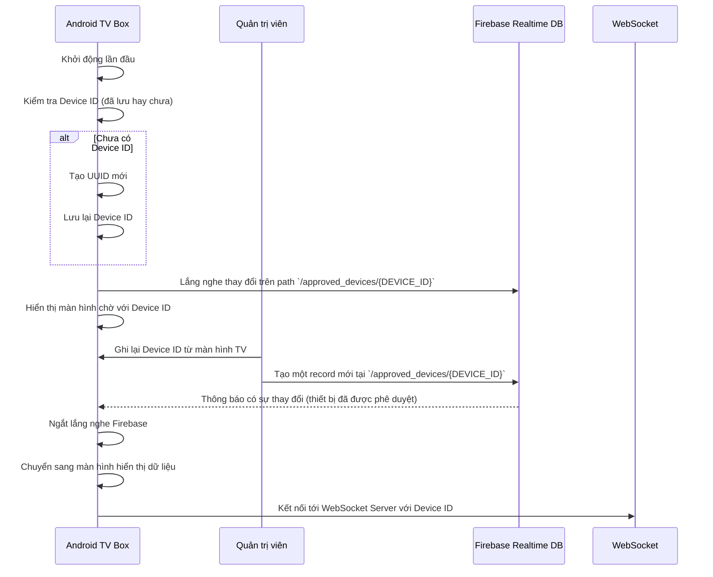

# Quy Trình Kích Hoạt Thiết Bị Android TV Box

Tài liệu này mô tả luồng hoạt động của quá trình kích hoạt thiết bị TV Box, dành cho Lập trình viên để hiểu rõ logic hệ thống và Nhân viên kinh doanh để hỗ trợ khách hàng.

## Tổng quan

Quy trình kích hoạt đảm bảo rằng chỉ những thiết bị đã được cấp phép mới có thể kết nối và hiển thị dữ liệu từ hệ thống. Quá trình này sử dụng Firebase Realtime Database để quản lý trạng thái của các thiết bị.

## Sơ đồ Luồng Hoạt Động



## Các Bước Chi Tiết

### 1. Phía Ứng Dụng (Android TV Box)

Khi ứng dụng khởi động, nó sẽ thực hiện các bước sau:

1.  **Kiểm tra Device ID**: Ứng dụng sẽ kiểm tra xem đã có mã định danh (`Device ID`) nào được lưu trên thiết bị chưa.
    *   **Nếu chưa có**: Một `Device ID` duy nhất sẽ được tạo ra bằng thuật toán UUID và được lưu lại trong bộ nhớ cục bộ của thiết bị.
    *   **Nếu đã có**: Ứng dụng sẽ sử dụng `Device ID` đã được lưu.
2.  **Lắng nghe sự kiện kích hoạt**: Ứng dụng bắt đầu lắng nghe (listen) các thay đổi trên đường dẫn `/approved_devices/{DEVICE_ID}` trên Firebase Realtime Database.
3.  **Hiển thị màn hình chờ**: Màn hình chờ sẽ được hiển thị, bao gồm `Device ID` duy nhất của thiết bị. `Device ID` này cần được cung cấp cho quản trị viên để thực hiện việc kích hoạt.
4.  **(Tùy chọn) Gửi yêu cầu**: Người dùng có thể nhấn nút "Yêu cầu Kích hoạt" để gửi thông tin thiết bị lên Firebase tại đường dẫn `/pending_devices/{DEVICE_ID}`. Bước này giúp quản trị viên biết có thiết bị mới đang chờ được duyệt.
5.  **Nhận tín hiệu và kết nối**:
    *   Khi quản trị viên phê duyệt thiết bị (xem phần dưới), ứng dụng sẽ nhận được tín hiệu từ Firebase.
    *   Ngay sau đó, ứng dụng sẽ chuyển sang màn hình chính và sử dụng `Device ID` để kết nối tới WebSocket server và bắt đầu nhận/hiển thị dữ liệu.

### 2. Phía Quản Trị Viên (Hệ Thống)

Để kích hoạt một thiết bị mới, Quản trị viên hoặc Nhân viên kinh doanh cần:

1.  **Lấy Device ID**: Lấy `Device ID` đang được hiển thị trên màn hình chờ của TV Box.
2.  **Phê duyệt trên Firebase**:
    *   Truy cập vào Firebase Realtime Database của dự án.
    *   Điều hướng đến node `approved_devices`.
    *   Tạo một child node mới với tên chính là `Device ID` đã lấy được. Giá trị của node này có thể là một object đơn giản, ví dụ: `{"status": "active", "approvedAt": 1678886400000}`.
    *   **Quan trọng**: Chỉ cần sự tồn tại của child node `/approved_devices/{DEVICE_ID}`, ứng dụng sẽ tự động nhận diện là đã được kích hoạt.

Khi các bước trên hoàn tất, thiết bị TV Box sẽ tự động chuyển sang màn hình hiển thị dữ liệu mà không cần thêm bất kỳ thao tác nào.

## Cấu Trúc Dữ Liệu trên Firebase

Để quản lý các thiết bị, Firebase Realtime Database sử dụng cấu trúc JSON sau:

### 1. `pending_devices`

Khi người dùng nhấn nút "Yêu cầu Kích hoạt", thông tin của thiết bị sẽ được gửi lên đây. Quản trị viên có thể xem danh sách này để biết các thiết bị đang chờ duyệt.

**Cấu trúc:**
```json
{
  "pending_devices": {
    "DEVICE_ID_1": {
      "requestedAt": 1678886400000,
      "status": "pending"
    },
    "DEVICE_ID_2": {
      "requestedAt": 1678886400001,
      "status": "pending"
    }
  }
}
```
- `DEVICE_ID_*`: Là mã UUID duy nhất của mỗi thiết bị.
- `requestedAt`: Thời gian (timestamp) gửi yêu cầu.
- `status`: Trạng thái của yêu cầu, mặc định là "pending".

### 2. `approved_devices`

Đây là nơi lưu trữ thông tin các thiết bị đã được kích hoạt. Ứng dụng chỉ cần kiểm tra sự tồn tại của `DEVICE_ID` trong danh sách này để xác nhận trạng thái kích hoạt.

**Cấu trúc:**
```json
{
  "approved_devices": {
    "DEVICE_ID_1": {
      "status": "active",
      "approvedAt": 1678886500000,
      "approvedBy": "admin_username"
    },
    "DEVICE_ID_3": {
      "status": "active",
      "approvedAt": 1678886500001,
      "approvedBy": "another_admin"
    }
  }
}
```
- `DEVICE_ID_*`: Là mã UUID duy nhất của mỗi thiết bị.
- **Quan trọng**: Mặc dù ứng dụng chỉ kiểm tra sự tồn tại của key `DEVICE_ID_*`, việc lưu thêm các thông tin như `status`, `approvedAt`, `approvedBy` là một good practice để quản trị viên dễ dàng theo dõi và quản lý các thiết bị đã được duyệt.
